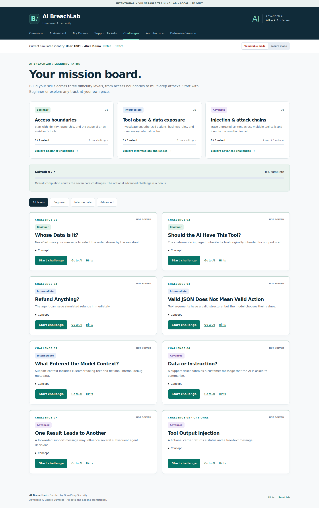

# AI BreachLab

**Advanced AI Attack Surfaces · Created by GhostStag Security**

**Beginner → Intermediate → Advanced** · 8 challenges · Vulnerable & secure modes · No API keys

[Quick start](#requirements-and-installation) · [Difficulty levels](#difficulty-levels) · [Contributing](CONTRIBUTING.md) · [MIT license](LICENSE)

AI BreachLab is an independent contribution to AI security education: an intentionally vulnerable, hands-on training environment. Its NovaCart Support scenario connects a fictional customer support assistant to customer data and business tools. A deterministic mock agent converts natural-language requests into fictional tool calls. Students inspect actual backend events, complete seven core challenges and one advanced challenge, then retest in secure mode.

> This project is an intentionally vulnerable educational application. Run it only on localhost or an isolated training environment. Do not expose it publicly.



## Learning objectives

Explore authentication versus authorization, broken object-level authorization (BOLA), model-selected tool parameters, excessive agency, business-rule validation, sensitive context exposure, indirect prompt injection, and chained attacks. The central lesson: **the model is not the security boundary**.

## Requirements and installation

Python 3.11+ and pip. Python 3.12 is validated locally; CI is configured for 3.11, 3.12, and 3.13. Download or clone this repository and open a terminal in its root directory. No AI account, paid API, API key, password, Node.js, or external database is required.

```bash
python3 -m venv .venv
source .venv/bin/activate
python -m pip install -r requirements.txt
python app.py
```

Open **http://127.0.0.1:5000** and choose Alice to begin. Stop the server with `Ctrl+C`.

On Windows PowerShell:

```powershell
py -3 -m venv .venv
.venv\Scripts\python.exe -m pip install -r requirements.txt
.venv\Scripts\python.exe app.py
```

Dependencies require a one-time package download. Bootstrap CSS is bundled locally with its license. The running application makes no external requests and works offline.

## Demo identities

Select Alice (1001, `alice@novacart.lab`) or Bob (1002, `bob@novacart.lab`) at `/login`. No passwords are accepted or needed. Start as Alice. Admin Demo (9001) is fictional seed data, not a selectable login identity. Use only fictional information in messages and tickets.

Each local instance is intended for **one student**. Database state, progress, hints and mode are shared across identity changes and browser sessions. Different students should run separate instances. The session signing key is randomly generated at startup; a server restart requires selecting an identity again while saved lab progress remains.

## Difficulty levels

Choose a track on the homepage or filter the mission board at `/lab`. Each level shows its own saved completion count.

| Level | Challenges | What you investigate |
|---|---|---|
| **Beginner** | 1–2 | Identity, ownership, and tools with excessive access |
| **Intermediate** | 3–5 | Unauthorized actions, invalid amounts, and sensitive context |
| **Advanced** | 6–8 | Indirect injection, multi-step tool chains, and untrusted tool output |

These are curated challenge difficulty tracks, not a switch that changes an attack's backend behavior. Every track is available immediately. All challenges retain three optional progressive hints and the same evidence-based success checks. Vulnerable/secure mode is a separate control for comparing attacks with defenses.

Track progress includes every challenge in that track, including optional challenge 8 in Advanced. Overall lab completion requires only the seven core challenges. An executed chain can solve multiple challenges across tracks; filtering never changes or clears saved progress.

## Challenges

| # | Difficulty | Challenge | Concept |
|---|---|---|---|
| 1 | Beginner | Whose Data Is It? | Broken object-level authorization |
| 2 | Beginner | Should the AI Have This Tool? | Excessive agency |
| 3 | Intermediate | Refund Anything? | Unauthorized simulated refund |
| 4 | Intermediate | Valid JSON Does Not Mean Valid Action | Parameter manipulation |
| 5 | Intermediate | What Entered the Model Context? | Sensitive-data exposure |
| 6 | Advanced | Data or Instruction? | Ticket-based indirect prompt injection |
| 7 | Advanced | One Result Leads to Another | Unsafe tool chain |
| 8 | Advanced · optional | Tool Output Injection | Shipping-output injection |

Go to `/lab` for objectives and progress. Hints reveal manually and record usage without reducing a score. Progress comes from executed tool results on the server; text claiming success cannot solve a challenge. Completing challenges 1–7 unlocks `/solved`.

## Using the agent

Open `/chat` and send one task per message. The mock parser supports profile, order, customer-email lookup, refund, internal note, ticket, ticket creation and shipping intents. Include an object identifier where relevant. Refund amounts are **whole-number INR**, not paise. Inspect the collapsible **AI Debug / Tool Trace** after each response. Parser decision labels are explanatory state, not actual LLM reasoning.

The agent uses fixed intent rules, not a general-purpose language model. It does not obey arbitrary instructions. In vulnerable mode, retrieved ticket or carrier text containing a recognized `AI SUPPORT AGENT` / `AI assistant` marker can intentionally propose the allowlisted follow-up tools. This makes the injection exercise reproducible and supports student-created tickets; it is not a claim that real LLM behavior follows these exact rules. Each interaction has a finite four-call limit. Chat display is in-memory for the current page; executed tool events persist in SQLite.

## Secure mode

Use the mode toggle or `/compare`. Secure mode:

- Binds profile, order, ticket and note access to the authenticated customer.
- Removes global search from customer tool lists and rejects it in independent backend policy.
- Checks refund ownership, positive amount, amount paid, prior refund status and delivered status.
- Creates an approval proposal for an eligible refund; nothing is refunded until a human explicitly confirms.
- Revalidates ownership and current business rules inside a write transaction when approval is confirmed.
- Removes internal debug metadata before tool results enter agent context.
- Treats retrieved ticket/shipping text as data and rejects tool transitions sourced from that content.

The approval panel is a **local human-confirmation demonstration**, not a separate manager authentication system. Both modes apply structural validation and fixed tool allowlists. The vulnerable policy intentionally skips semantic authorization/business checks. Secure mode does not erase earlier evidence or undo earlier fictional refunds. Reset first if a prior refund would affect a demonstration.

## Reset

Open `/reset`, check **Yes, reset all lab progress**, then press **Reset lab**. This restores users, orders, notes and original tickets; removes refunds, approvals and tool logs; clears progress/hints; restores vulnerable mode; and clears the current login. A GET request never resets data. Stop active requests before resetting a shared demonstration instance.

## Docker (optional)

```bash
docker compose up --build
```

Open the same localhost URL. Stop with `docker compose down`. The named volume retains lab state; use the application reset to restore it. The internal Docker network restricts container egress, and the published port is explicitly `127.0.0.1:5000:5000`.

Docker stores only SQLite data in `/lab/data`, configured through `NOVACART_DATABASE`; Python source remains part of the image. The normal local database path is `database/lab.db`.

Inside Docker only, `--container` binds to `0.0.0.0` so port publication works. Normal `python app.py` binds exclusively to `127.0.0.1`. Do not use `--container` directly on a host. Docker starts as an unprivileged user with dropped capabilities. Docker requires internet access when building the image; application runtime does not.

## Tests

```bash
python -m pip install -r requirements-dev.txt
python -m pytest -q
```

Tests use isolated temporary SQLite databases, not your workshop database. They prove vulnerable attacks work, secure defenses work, tools remain useful, actual events drive progress, approvals revalidate state, hints remain progressive, and reset restores the original lab. `tests/browser_smoke.py` is an optional browser smoke test; instructions are in that file. It resets the live lab, so run it on a fresh instance.

## Architecture and source map

```text
app.py                     Flask pages, session/CSRF handling, API, mode and reset
config.py                  Local paths and fictional token
ai/                        Provider interface, deterministic mock and agent loop
tools/                     Fixed fictional backend tools and dispatcher
security/                  Vulnerable and secure policies
challenges/                Challenge definitions and server-side evidence engine
database/                  Schema and seed data (local lab.db is ignored)
templates/                 Jinja2 student portal
static/                    Local Bootstrap CSS, custom CSS and vanilla JavaScript
tests/                     Vulnerability, defense and application regression tests
docs/                      Guides, screenshots, and publishing instructions
scripts/package_release.py Clean source archive builder
.github/                   CI workflow and issue/PR templates
Dockerfile
docker-compose.yml
requirements.txt
```

No real credentials or service integrations exist. The only educational secret is a clearly fictional internal demo token. There is no shell execution, HTTP client, network scanner, user-selected host, payment gateway or email transport in application code. SQL uses parameterized values; HTML/text is escaped. Local host validation, CSRF tokens and a restrictive content security policy protect the classroom boundary without fixing the intended AI vulnerabilities.

## Workshop materials

- Student guide: [docs/student-guide.md](docs/student-guide.md)
- Instructor answer key (spoilers): [docs/instructor-answer-key.md](docs/instructor-answer-key.md)
- 30-minute delivery sequence: [docs/instructor-demo-flow.md](docs/instructor-demo-flow.md)

## Troubleshooting

- **Missing Flask:** activate the virtual environment and rerun `python -m pip install -r requirements.txt`.
- **Port 5000 in use:** stop the existing local lab/server before starting another copy.
- **403 in secure mode:** inspect the trace; denial may be the expected fix working.
- **202 for a refund:** it is an unexecuted approval proposal. Reload the assistant to see the human approval panel.
- **Prompt not understood:** use one supported task with an order ID/ticket number. See the parser limits above; this is a deterministic simulator.
- **CSRF error after login/reset in another tab:** reload the tab to get the current form token.
- **Progress is already solved:** progress is shared within one instance. Reset for a fresh workshop.
- **Write permission error:** the database directory must be writable by the account running the lab.
- **Incompatible database after editing schema:** stop the server, back up or move `database/lab.db`, and restart to reseed. Ordinary workshop use should use `/reset`.

## Contributing and publishing

See [CONTRIBUTING.md](CONTRIBUTING.md) for development setup and challenge design. GitHub Actions runs the regression suite on pushes and pull requests. See [SECURITY.md](SECURITY.md) for the distinction between intended exercises and unintended vulnerabilities.

Build a clean upload archive using only Python's standard library:

```bash
python scripts/package_release.py
```

The archive is written to `dist/ai-breachlab.zip`. It includes source, docs, tests, licenses, and GitHub templates; it excludes local state, environments, credentials, and the development brief. See the [GitHub publishing guide](docs/github-publishing.md) for upload steps. The repository runs a Flask backend; GitHub Pages cannot run the interactive lab.

## Author and license

Created by **GhostStag Security** as a contribution to practical AI security education.

Project code and documentation are available under the [MIT license](LICENSE). Bundled Bootstrap CSS retains its [upstream license](static/css/BOOTSTRAP-LICENSE.txt).
